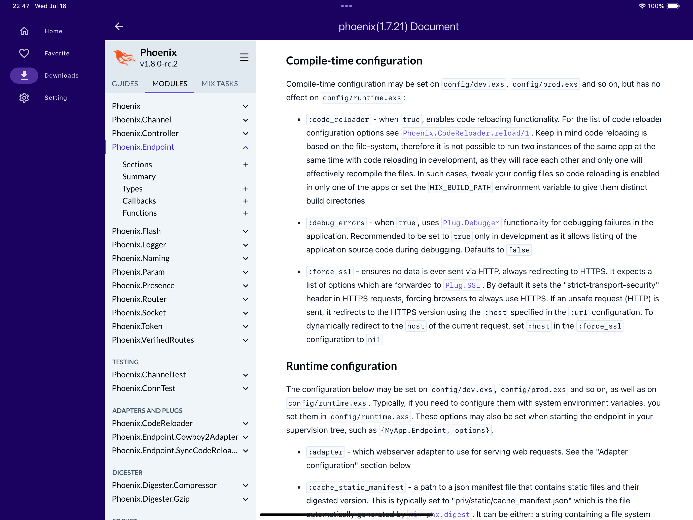

# Mobile Hex.pm App

A Flutter mobile application for browsing [Hex.pm](https://hex.pm) packages and reading Hexdocs offline.



## Features

- 📦 **Browse Hex.pm Packages**: Search and explore Elixir/Elm packages from the Hex.pm registry
- 📚 **Offline Documentation**: Download and read Hexdocs offline without internet connection
- ⭐ **Favorites**: Save your favorite packages and releases for quick access
- 🔍 **Advanced Search**: Find packages by name, description, or keywords
- 🌙 **Dark/Light Theme**: Full theme support with multiple color schemes
- 📱 **Responsive Design**: Adaptive UI for both phones and tablets
- 🔧 **Settings Management**: Configure app behavior and preferences
- 🌍 **Internationalization**: Multi-language support

## Architecture

This app uses a modular architecture with the following key components:

### Monorepo Structure
- **Melos**: Manages the monorepo workspace with multiple packages
- **BLoC Pattern**: State management for reactive UI updates
- **Modular Packages**: Separated concerns across different packages

### Core Packages
- **app_lib/**: Core libraries (theme, locale, provider, database)
- **app_bloc/**: BLoC state management (theme, hex_auth, hex_search, favorites, hex_doc)
- **app_widget/**: Reusable UI components (adaptive, artwork, feedback, web_view)
- **app_api/**: API integration (hex_api, hex_pm_api)
- **third_party/**: Custom third-party packages and utilities

### Technology Stack
- **Flutter 3.6+**: Cross-platform mobile development
- **BLoC 9.0**: State management pattern
- **go_router**: Declarative routing
- **SQLite**: Local database for offline storage
- **WebView**: For rendering Hexdocs content

## Getting Started

### Prerequisites
- Flutter SDK (>=3.6.0)
- Dart SDK
- Melos for monorepo management
- Android Studio / Xcode for mobile development

### Installation

1. **Clone the repository**
   ```bash
   git clone <repository-url>
   cd mobile-hex-pm
   ```

2. **Install dependencies**
   ```bash
   # Bootstrap all packages
   melos bootstrap

   # Prepare the project
   melos run prepare
   ```

3. **Generate code**
   ```bash
   # Run code generation for all packages
   melos run build-runner

   # Generate localization files
   melos run gen-l10n
   ```

4. **Run the app**
   ```bash
   flutter run
   ```

## Development Commands

### Project Setup
```bash
# Initial project preparation
melos run prepare

# Bootstrap all packages
melos bootstrap
```

### Build & Code Generation
```bash
# Generate code for all packages
melos run build-runner

# Generate localization files
melos run gen-l10n

# Generate app icons
dart run flutter_launcher_icons:main
```

### Static Analysis & Code Quality
```bash
# Run analyze with fatal infos
melos run analyze

# Format code
melos run format

# Format check (fails if changes needed)
melos run format-check

# Fix Dart issues
melos run fix

# Fix dry-run (preview changes)
melos run fix-dry-run
```

### Testing
```bash
# Run all tests (Dart and Flutter)
melos run test

# Run Flutter tests only
melos run test:flutter

# Run Dart tests only
melos run test:dart

# Run tests for specific package
cd <package_directory> && flutter test
```

### Dependencies
```bash
# Upgrade all dependencies
melos run upgrade

# Check for outdated dependencies
melos run outdated

# Validate dependency usage
melos run validate-dependencies
```

## Deployment

This project uses [Fastlane](https://fastlane.tools/) for automated deployment to App Store and Google Play.

### Setup
```bash
# Install Ruby dependencies
bundle install
```

### iOS Deployment
```bash
# Deploy to TestFlight (staging)
./ios/run_fastlane.sh <build_number>

# Or run specific lanes
cd ios && bundle exec fastlane deploy_staging      # TestFlight
cd ios && bundle exec fastlane deploy_production   # App Store
```

### Android Deployment
```bash
# Deploy to Play Store internal track (staging)
./android/run_fastlane.sh <build_number>

# Or run specific lanes
cd android && bundle exec fastlane deploy_staging     # Internal track
cd android && bundle exec fastlane deploy_production  # Beta track
```

### Required Environment Variables

**iOS:**
- `APP_STORE_CONNECT_KEY_IDENTIFIER` - App Store Connect API key ID
- `APP_STORE_CONNECT_ISSUER_ID` - App Store Connect API issuer ID
- `APP_STORE_CONNECT_PRIVATE_KEY` - App Store Connect API private key
- `TEAM_ID` - Apple Developer Team ID
- `ITC_TEAM_ID` - App Store Connect Team ID

**Android:**
- `PLAY_CONSOLE_SA` - Google Play Console service account JSON key content

## Project Structure

```
mobile-hex-pm/
├── lib/                          # Main app source code
│   ├── screens/                  # UI screens
│   │   ├── home/                # Home and search functionality
│   │   ├── favorite/            # Favorite packages and releases
│   │   ├── offline_docs/        # Offline documentation viewer
│   │   └── settings/            # App settings
│   ├── app.dart                 # Main app widget
│   ├── router.dart              # Navigation routing
│   └── main.dart                # App entry point
├── app_lib/                     # Core library packages
├── app_bloc/                    # BLoC state management
├── app_widget/                  # UI components
├── app_api/                     # API integrations
├── third_party/                 # Custom third-party packages
├── android/                     # Android platform code
├── ios/                         # iOS platform code
└── fastlane/                    # App deployment configuration
```

## Contributing

1. Fork the repository
2. Create a feature branch (`git checkout -b feature/amazing-feature`)
3. Commit your changes (`git commit -m 'Add some amazing feature'`)
4. Push to the branch (`git push origin feature/amazing-feature`)
5. Open a Pull Request

## License

This project is licensed under the MIT License - see the LICENSE file for details.

## Support

If you have any questions or issues, please file an issue on the GitHub repository.

